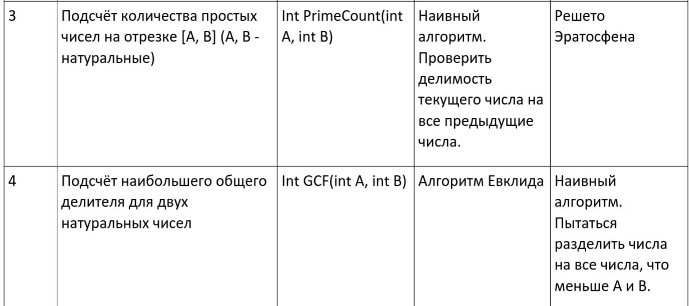

# Лабораторная работа № 4

Составить и отладить программу на языке Си, осуществляющую работу с динамическими библиотеками.
Пользовательский ввод для обоих программ должен быть организован следующим образом:
1. Если пользователь вводит команду «0», то программа переключает одну реализацию
контрактов на другую (необходимо только для программы No2). Можно реализовать
лабораторную работу без данной функции, но максимальная оценка в этом случае будет
«хорошо»;
2. «1 arg1 arg2 ... argN», где после «1» идут аргументы для первой функции, предусмотренной
контрактами. После ввода команды происходит вызов первой функции, и на экране
появляется результат её выполнения;
3. «2 arg1 arg2 ... argM», где после «2» идут аргументы для второй функции,
предусмотренной контрактами. После ввода команды происходит вызов второй функции,
и на экране появляется результат её выполнения.

# Вариант 16

*Функции №3 и №4 для варианта 16*

# Ссылка на отчет
- [Отчёт](https://docs.google.com/document/d/1Dwj938rbBYm6bRIyYlHj52rilvz-MZlt7R1hjerrGZk/edit?usp=sharing)

## Запуск: 

- `cd lab4`
- `mkdir build`
- `cd build`
- `cmake ../ .`
- `make`
- Запускаем `./lab4`
